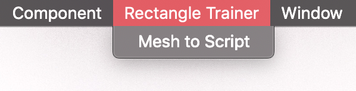
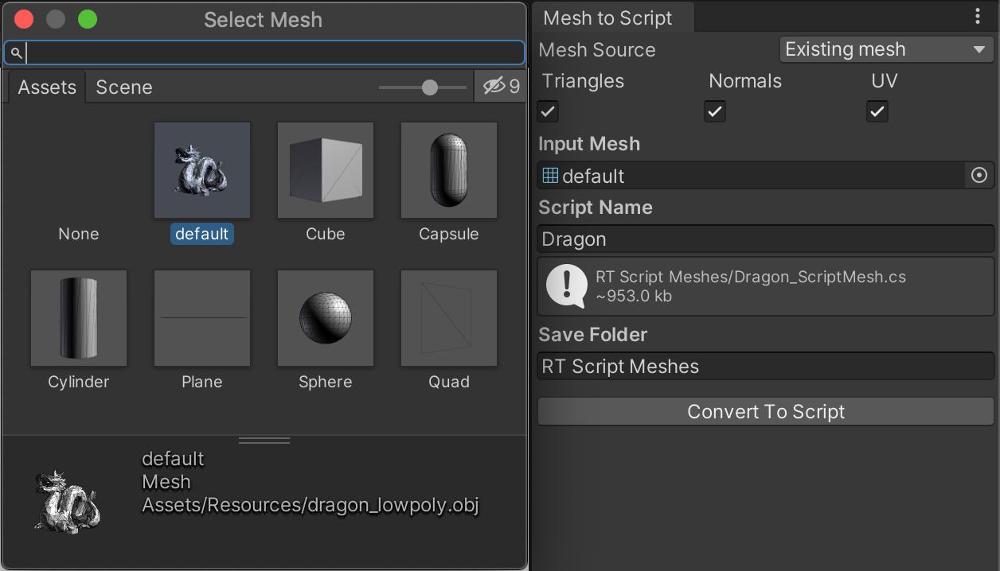
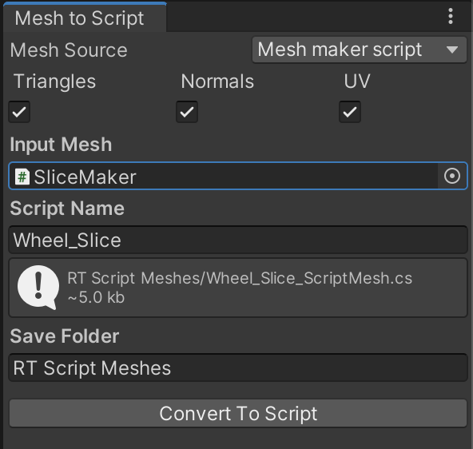
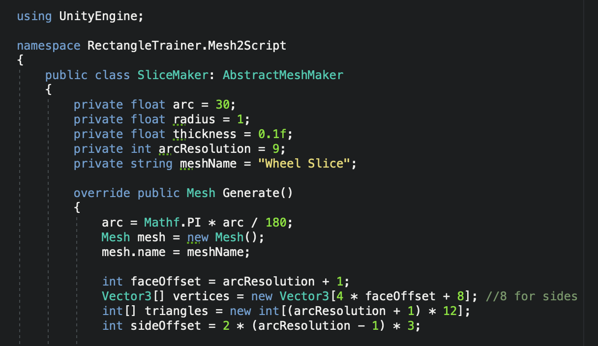
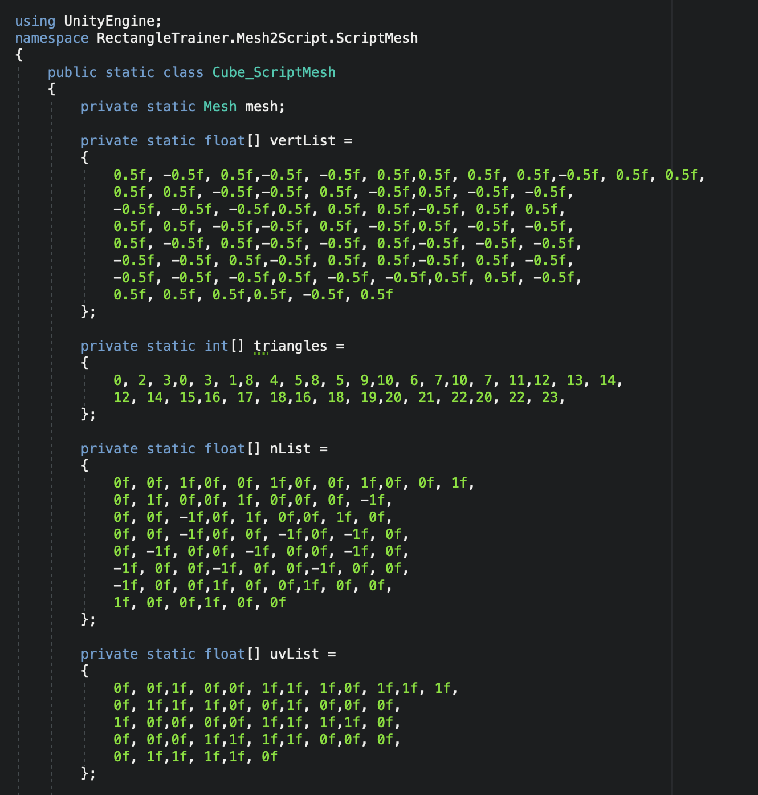

# Mesh to Script Converter
Mesh to script converter is a simple tool that converts a mesh into a C# script that contains the mesh as hardcoded data.

There are uncommon but not entirely impossible scenarios where having the 3D data embedded right in the code is a better solution than keeping a mesh file.
Or you might have a cpu intensive code that generates a mesh that would could be calculated once and get hardcoded into its own script. In any case, mesh to scrip converter let's you do exactly that.

Once you add this into your project, the Rectangle Trainer menu will appear, from which you can open the editor window.

The input can either be an existing mesh 

Or a script that generates a mesh 

As long as the script extends the abstract mesh maker class, like the one above, you're good to go: 

Once the conversion is complete, this is what it looks like: 

After that, you can simply access the mesh by using the Mesh property, both in editor and game modes.
